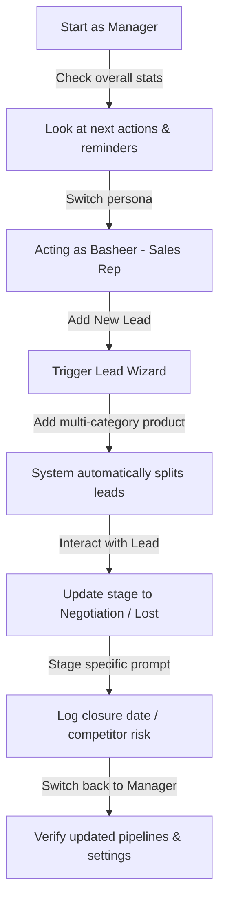

# Sales OS Prototype & Presentation: Kickoff Meeting Demo Guide

This guide is designed to help you set up, run, and deliver a smooth demo of the **Sales OS Prototype** and the **Statement of Work (SOW) Presentation** during your Google Meet kickoff meeting.

---

## 📋 1. Pre-Meeting Setup Checklist

Follow these steps **15–30 minutes before** your meeting to ensure everything loads instantly and works flawlessly.

### Step 1: Start the Local Development Server
1. Open your terminal (e.g., PowerShell or Command Prompt).
2. Navigate to the `sales-os-app` directory:
   ```powershell
   cd "c:\Users\Basheer\GitHub\Calicut_Bio_Medicals\sales-os-app"
   ```
3. Run the Vite development server:
   ```powershell
   npm run dev
   ```
4. Verify the server is running. It will output a local address, typically **`http://localhost:5173/`**.

### Step 2: Open the Demo in Your Browser
Open your browser (preferably Chrome/Edge for Google Meet compatibility) and load these two URLs in separate tabs:
1. **The Interactive Phone Prototype:** Open **`http://localhost:5173/phone-demo.html`**
   * *Why?* This opens the React app inside a beautiful, realistic Pixel 7 phone frame, making it look highly polished and premium for client presentations.
2. **The Proposal Presentation:** Double-click or open the file **[Presentation.html](file:///c:/Users/Basheer/GitHub/Calicut_Bio_Medicals/Presentation.html)** in your browser.
   * *Why?* This is your 7-slide kickoff deck that details the Statement of Work, project timeline, and phases.

### Step 3: Clean the Demo State (Crucial)
Since the app persists changes in `localStorage`, you want to start with a clean dataset so the default deals, actions, and customers load correctly:
1. Open the phone-demo tab (**`http://localhost:5173/phone-demo.html`**).
2. Right-click anywhere and select **Inspect** (or press `F12`) to open Developer Tools, and navigate to the **Console** tab.
3. Paste and run the following command to wipe previous test data:
   ```javascript
   localStorage.clear(); window.location.reload();
   ```
4. Close Developer Tools. Your prototype is now in a pristine "demo-ready" state!

---

## 🎥 2. Google Meet Optimization Tips

To present like a pro and avoid common screen-sharing glitches, use these settings during the call:

* **Share a Tab, Not Your Screen/Window:** 
  In Google Meet, click **Present now** ➔ select **A tab**. Choose the tab with `phone-demo.html` or `Presentation.html`.
  * *Benefits:* 
    * Captures high-frame-rate rendering, making animations and page transitions look buttery smooth.
    * Hides your taskbar, bookmarks, other browser tabs, and desktop notifications.
* **Go Fullscreen:**
  In your browser, press **`F11`** (Windows) to enter distraction-free full-screen mode for the active tab. This makes the Pixel 7 frame fill the viewport beautifully.
* **Minimize Audio Interference:**
  If you play any audio files from the `Requirements` folder during the meeting, ensure Google Meet's tab audio sharing is turned on when sharing that specific tab.

---

## 🚶‍♂️ 3. Step-by-Step Demo Script

Here is a structured sequence to guide the client through the proposal and prototype.

### Part A: Set the Stage (The Presentation)
1. Present the **[Presentation.html](file:///c:/Users/Basheer/GitHub/Calicut_Bio_Medicals/Presentation.html)** tab.
2. Briefly walk through:
   * **Slide 1-2 (Executive Summary):** Highlight that the goal is to optimize the current CRM for top-performing sales representatives.
   * **Slide 3 (Scope):** Explain the 2-week workflow shadowing and data readiness audit (emphasizing no active coding will happen in production yet).
   * **Slide 7 (Next Steps):** Point out the split path: Pathway A (build custom integrations if CRM is viable) vs Pathway B (CRM migration roadmap if legacy APIs are inadequate).

---

### Part B: Show the Vision (The Sales OS Prototype)
Switch to the **Sales OS Prototype** tab. Explain that this represents the *Target UI* you are evaluating for their field team.



#### Scenario 1: The Manager Dashboard & Quotas
* **Action:** Open the sidebar (click `☰` in the top left). Under **Team Management**, ensure **Acting As** is set to `👑 Manager`. Navigate to **Pipeline View** or **Deals List**.
* **Talking Point:** *"As a Manager, I see a bird's-eye view of all territories (North Kerala, South Kerala, Bangalore) and their total pipeline value, booked revenue, and quota attainment."*
* **Action:** Go to the sidebar and click **Target Settings**.
* **Talking Point:** *"Managers can configure annual and quarterly quotas for each representative (Basheer, Amit, Rahul) directly in the system."*

#### Scenario 2: The Sales Rep Experience (Basheer)
* **Action:** Open the sidebar `☰`, change the persona in the drop-down to `👤 Basheer (Sales)`. The app automatically redirects to the Pipeline.
* **Talking Point:** *"Now I am acting as Basheer, a field rep. Notice how the view immediately filters to focus only on my North Kerala deals, removing noise."*
* **Action:** Click **Next Actions** in the sidebar.
* **Talking Point:** *"Instead of hunting through pages, my day starts with a list of immediate follow-ups. If I mark an action complete, it logs it to the deal's history automatically."*

#### Scenario 3: Creating a Multi-Category Lead (Lead Splitting Logic)
* **Action:** Go to the top bar and click the blue **＋ Lead** button.
  1. **Step 1:** Search for or select **`Al Shifa Hospital`** (or create a new customer). Click **Next**.
  2. **Step 2:** Under Product Selection, select **`SonoScape S50 Elite`** (Ultrasound category) **AND** **`Magnamed Fleximag Max`** (Critical Care category). Click **Next**.
  3. **Step 3 (Summary):** Observe the system notification indicating a multi-category lead. Click **Create Lead**.
* **Talking Point:** *"In a standard CRM, reps enter combined deals, which makes pipeline forecasting inaccurate. In Sales OS, when we create a lead with products from different divisions, the system automatically splits them into separate tracking pipelines and assigns them to the respective territory manager."*
* **Action:** Go back to the **Pipeline View** and point out the newly created, separated leads under the "Lead" column.

#### Scenario 4: Progressing a Deal & Risk Prompts
* **Action:** Locate the **`Al Shifa Hospital`** deal. Use the drop-down on the card to change its stage to **Negotiation**.
* **Talking Point:** *"When a rep updates a deal to key stages, the CRM shouldn't just save a change; it should guide them."*
* **Action:** Point out the pop-up modal requiring the **Expected Closure Date**. Enter a date and click **Save**.
* **Action:** Take another deal and select **Lost** as the stage.
* **Talking Point:** *"If a deal is lost, the system forces us to capture the competitor name and reason (e.g., price vs. product gap). This feeds our analytics directly."*

---

## 🛠️ 4. Quick Troubleshooting

* **Blank Screen / Errors:** 
  If you accidentally trigger a React crash, just run `localStorage.clear(); location.reload();` in the browser console.
* **Pixel 7 Frame Layout Clipping:** 
  Make sure your browser zoom is set to `100%`. If the phone frame is too tall for your screen, zoom out slightly (e.g., `90%` or `80%` using `Ctrl` + `-`) to fit it nicely.
* **Logo missing:** 
  The app references `/Cabio logo.jpeg` which is loaded from the `public` directory. Make sure it loads correctly.

Good luck with your kickoff meeting! Keep this guide handy as you walk the client through the demo.
