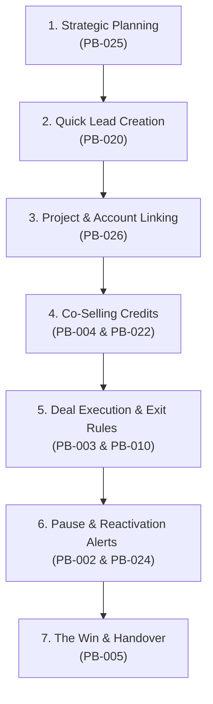

# Presentation Plan: Wave 1 Core Sales Workflow Demo

To engage your audience of **founders** (who care about governance, revenue, and accountability) and **key sales staff** (who care about usability and efficiency), this plan avoids a dry "feature-by-feature" checklist. Instead, it frames the demo as a logical **"Day in the Life of a Sales Rep and Manager"** narrative.

---

## Narrative Overview: "From Quarter Planning to Commission Check"

We will follow a deal's lifecycle through **7 key scenes**, demonstrating how the prototype enforces clean data without slowing down the sales rep.

---

## Scene-by-Scene Demo Script

### Scene 1: Setting up the Quarter (Planning)
* **PBs Covered:** **PB-025** (Beat Planning Foundation)
* **Role/Persona:** **Basheer** (Sales Rep) $\rightarrow$ **Manager**
* **What to Show:**
  1. Log in as **Basheer**. Navigate to **Beat Planning**.
  2. Create a new **Q3 2026 Beat Plan** and show how you can plan multiple accounts (e.g. Apollo Hospitals and Aster Medcity) side-by-side in a single grid, specifying expected visits, expected revenue, and strategic objectives.
  3. Save as draft, then **Submit** the plan.
  4. Toggle role to **Manager**. Show the pending plan, click **Approve**, and show how the manager's KPI dashboard instantly recalculates overall progress and expected team revenue.
* **Why it matters:**
  * **For Founders:** Drives forecasting accuracy and accountability.
  * **For Sales Staff:** Centralizes quarterly objectives instead of filling out weekly spreadsheets.

---

### Scene 2: The Prospect Handout (Leads Ingest)
* **PBs Covered:** **PB-020** (Pre-Lead Scanning)
* **Role/Persona:** **Basheer** (Sales Rep)
* **What to Show:**
  1. Go to **Deals Pipeline** and click **+ New Lead** to open the Creation Wizard.
  2. Point out the **"Scan Product Datasheet"** upload box.
  3. Upload the EDAN i15 flyer/brochure image (located in your folder).
  4. Show the fields (Lead Name, Budget, Product Category, Notes) auto-populate instantly from the scan.
* **Why it matters:**
  * **For Founders:** Boosts CRM adoption. If it's easy to enter leads, reps will use the system.
  * **For Sales Staff:** Saves time typing technical product specifications in the field.

---

### Scene 3: Structural Alignment (Accounts & Projects)
* **PBs Covered:** **PB-026** (Project Opportunity Foundation)
* **Role/Persona:** **Basheer** (Sales Rep)
* **What to Show:**
  1. In Step 2 of the lead creation wizard, locate the **"Associated Project"** dropdown.
  2. Explain that the hospital has a master expansion project running: select **"Apollo North Hospital Expansion"**.
  3. Save the deal. Navigate to **Projects** in the sidebar, click on this project, and show how the system aggregates all deals related to this project in one place.
* **Why it matters:**
  * **For Founders:** Gives executive visibility into macro client accounts. You see the total pipeline value of a hospital's expansion program, not just isolated orders.

---

### Scene 4: Structuring the Economics (Co-Selling Splits)
* **PBs Covered:** **PB-004** (Shared Opportunity Ownership) & **PB-022** (Split Validation 100% Rule)
* **Role/Persona:** **Basheer** (Sales Rep)
* **What to Show:**
  1. Open the newly created deal. Show the **"Contributors"** grid.
  2. Add **Amit** as a *Product Specialist* with a **40% split**, and adjust **Basheer** to **50%**.
  3. Click Save. The system should block the save and trigger a **Warning Alert**: *"Total splits must equal exactly 100%!"*
  4. Correct Basheer's split to **60%** and save successfully.
* **Why it matters:**
  * **For Founders:** Eliminates double-counting of commissions and pipeline metrics.
  * **For Sales Staff:** Guarantees proper attribution and collaborative credit for product experts.

---

### Scene 5: Executing the Sale (Exit Criteria & Mandatory Logging)
* **PBs Covered:** **PB-003** (Stage Exit Criteria Enforcement) & **PB-010** (Mandatory Interaction Logging)
* **Role/Persona:** **Basheer** (Sales Rep)
* **What to Show:**
  1. Move the deal from **Qualified** to **Demo**. 
  2. Show that moving a deal into "Demo" requires entering a **Demo Date** and **Demo Outcome**.
  3. Try to save the stage change *without* adding an interaction note. The system blocks it: *"An interaction log is required to move this deal."*
  4. Write a brief log (e.g. *"Conducted SonoScape demo; clinical team gave positive feedback"*), select the interaction type, and click Save. Show how it logs into the deal's timeline history.
* **Why it matters:**
  * **For Founders:** Ensures clean CRM data. No "ghost" pipeline stages; every deal has verified progress.
  * **For Sales Staff:** Standardizes expectations on what is needed to progress a sale.

---

### Scene 6: Managing Delays (On Hold & Reactivations)
* **PBs Covered:** **PB-002** (Opportunity State "On Hold") & **PB-024** (Overdue Reactivation Case)
* **Role/Persona:** **Basheer** (Sales Rep) $\rightarrow$ **Manager**
* **What to Show:**
  1. Explain that the client's finance director is traveling, pausing the deal.
  2. Edit the deal state from **Active** to **On Hold**. Select the reason **"Budget Approval Pending"** and set a **Reactivation Date** (e.g. set it to a date in the past, like yesterday, to simulate an overdue trigger).
  3. Save the deal. Show that it is visually greyed out in the pipeline.
  4. Show how the deal card immediately flags a **⚠️ OVERDUE REACTIVATION** alert badge (e.g. *Overdue by 1 day*).
* **Why it matters:**
  * **For Founders:** Prevents deals from falling into a "silent graveyard." The system proactively prompts team engagement.
  * **For Sales Staff:** Reminds reps when it is time to reconnect with an inactive client.

---

### Scene 7: Win-Loss Audit & Operations Handover
* **PBs Covered:** **PB-005** (Closed-Won Handover)
* **Role/Persona:** **Basheer** (Sales Rep)
* **What to Show:**
  1. The PO is finally received. Change the deal stage to **Closed Won**.
  2. Show the **Handover Card** modal that pops up.
  3. Fill out the required **PO Number**, **Delivery Notes**, and complete the installation checklist (e.g., *Power supply verified*, *Space cleared*).
  4. Save. Show that the handover details are now frozen on the deal profile for the operations team.
* **Why it matters:**
  * **For Founders:** Smooth transition from sales to post-sales. Prevents billing delays and delivery mistakes.
  * **For Sales Staff:** Clears their plate. The operations team gets structured inputs without requiring follow-up meetings.

---

## 💡 Quick Tips for a Successful Run
* **Use Existing Data:** Start by showing the dashboard with existing mock data so founders see what the charts look like under normal use.
* **Role Play:** Verbally call out when you switch roles: *"Now, I'm putting on my Manager hat to review Basheer's draft..."*
* **Highlight Guardrails:** Emphasize that the system **prevents errors on-the-fly** (like the 100% split rule or exit criteria) rather than forcing reps to clean up data retroactively.
